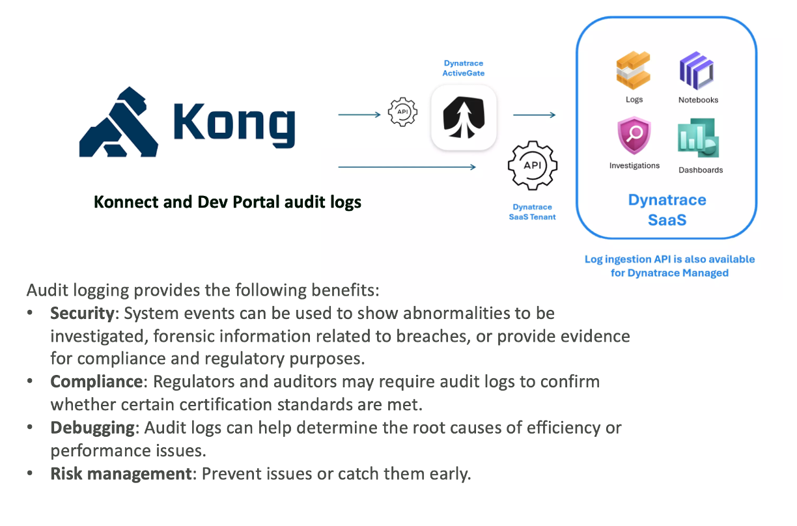

# Kong Konnect Audit Log Extension

A **Dynatrace Extension 2.0** that bundles an OpenPipeline configuration and dashboard for monitoring [Kong Konnect Audit Logs](https://docs.konghq.com/konnect/org-management/audit-logging/).



---

## What It Does

Kong Konnect streams audit logs to Dynatrace via webhook (`/api/v2/logs/ingest`). This extension:

1. **OpenPipeline source** — routes incoming logs from the extension source to a dedicated pipeline
2. **OpenPipeline pipeline** — parses Kong's JSON audit log format, extracting and enriching fields for authentication, authorization, and access events
3. **Dashboard** — visualizes audit activity: event counts, user activity, security events, and failed operations

---

## Getting Started

| I want to… | Go to |
|------------|-------|
| Install using the pre-signed ZIP | [INSTALL.md](INSTALL.md) |
| Build from source or publish a release | [DEVELOP.md](DEVELOP.md) |

---

## Project Structure

```
extension-kong-auditlog/
├── extension/
│   ├── extension.yaml                  # Extension manifest
│   ├── documents/
│   │   └── overview.dashboard.json     # Kong Audit Logs dashboard
│   └── openpipeline/
│       ├── logs.pipeline.json          # Log parsing pipeline
│       └── logs.source.json            # Log source routing config
├── images/                             # Screenshots used in documentation
├── INSTALL.md                          # Installation guide
├── DEVELOP.md                          # Build and release guide
├── Makefile                            # Build automation
└── LICENSE.md
```

---

## OpenPipeline Field Mapping

The pipeline maps Kong Konnect's raw JSON fields to the [Dynatrace Audit Log semantic model](https://docs.dynatrace.com/docs/semantic-dictionary/model/log#audit-logs). Fields with no semantic equivalent are stored as `kong.konnect.*` vendor-namespaced attributes.

### Common Fields (all event types)

| Konnect JSON Field | DT Semantic Field | Transform |
|---|---|---|
| `principal_name` / `principal_id` | `audit.identity` | `coalesce(principal_name, principal_id)` |
| `event_ts` | `audit.time` | `toTimestamp(event_ts)` |
| `src` | `client.ip` | direct |
| `user_agent` | `browser.user_agent` | direct |
| `trace_id` | `trace_id` | direct |
| `trace_id` + `rt` | `log.record.uid` | `concat(trace_id, "_", rt)` |
| `rt` | `timestamp` | `rt * 1,000,000` — Unix ms → DT nanoseconds |
| _(static)_ | `log.source` | `"kong-audit-webhook"` |
| _(static)_ | `cloud.provider` | `"konghq"` |
| `org_id` | `kong.konnect.org.id` | vendor namespace |
| `sig` | `kong.konnect.sig` | vendor namespace |
| `kong_initiated` | `kong.konnect.initiated` | vendor namespace |

### Authentication Events

Detected by: `matchesPhrase(content, '"success"')`

| Konnect JSON Field | DT Semantic Field | Transform |
|---|---|---|
| `event_class_id` | `audit.action` | `AUTHENTICATION_TYPE_BASIC` → `"Basic Authentication"`, etc. |
| `success` | `audit.result` | `true` → `"Succeeded"`, `false` → `"Failed"` |
| `name` | `audit.status` | `AUTHENTICATION_OUTCOME_SUCCESS` → `"Succeeded"`, `LOCKED`/`DISABLED` → `"Active"`, others → `"Failed"` |

### Authorization Events

Detected by: `matchesPhrase(content, '"granted"')`

| Konnect JSON Field | DT Semantic Field | Transform |
|---|---|---|
| `action` | `audit.action` | direct |
| `granted` | `audit.result` | `true` → `"Succeeded"`, `false` → `"Failed"` |
| `granted` | `audit.status` | same as `audit.result` |
| `actor_id` | `kong.konnect.actor.id` | vendor namespace |

### Access Events

Detected by: `matchesPhrase(content, '"act"')`

| Konnect JSON Field | DT Semantic Field | Transform |
|---|---|---|
| `act` + `request` | `audit.action` | `concat(act, " ", request)` e.g. `"POST /konnect-api/..."` |
| `status` | `audit.result` | `2xx` → `"Succeeded"`, others → `"Failed"` |
| `status` | `audit.status` | same as `audit.result` |
| `status` | `result.code` | direct (long) |

---

## DQL Anchor Queries

```dql
// All Konnect audit events
fetch logs
| filter log.source == "kong-audit-webhook"
| fields timestamp, konnect_format, audit.identity, audit.action, audit.result, client.ip, result.code
| sort timestamp desc

// Authentication failures by method
fetch logs
| filter log.source == "kong-audit-webhook" and konnect_format == "authentication" and audit.result == "Failed"
| summarize failures = count(), by: {audit.action, audit.identity, client.ip}
| sort failures desc

// Authorization denials
fetch logs
| filter log.source == "kong-audit-webhook" and konnect_format == "authorization" and audit.result == "Failed"
| fields timestamp, audit.identity, audit.action, client.ip
| sort timestamp desc

// Access errors (4xx / 5xx)
fetch logs
| filter log.source == "kong-audit-webhook" and konnect_format == "access" and result.code >= 400
| fields timestamp, audit.identity, audit.action, result.code
| sort timestamp desc
```

---

## Resources

- [Dynatrace Extensions 2.0 Documentation](https://docs.dynatrace.com/docs/ingest-from/extensions)
- [OpenPipeline Documentation](https://docs.dynatrace.com/docs/platform/openpipeline)
- [Kong Konnect Audit Logs](https://docs.konghq.com/konnect/org-management/audit-logging/)
