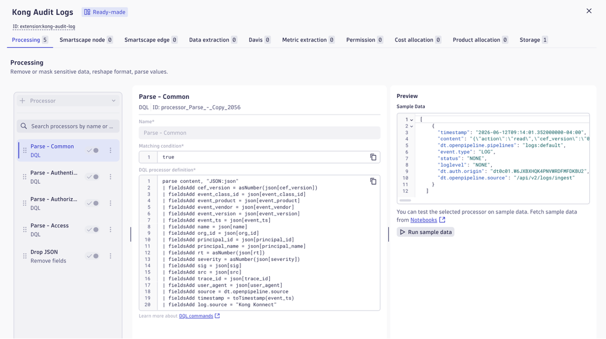
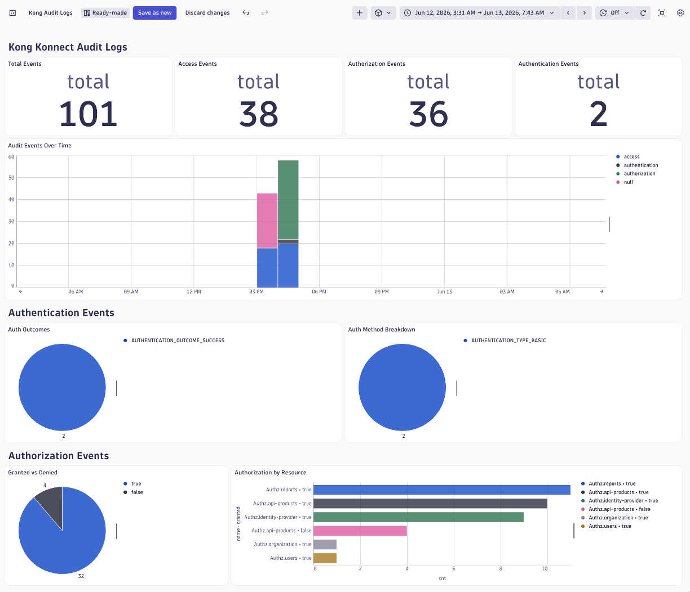
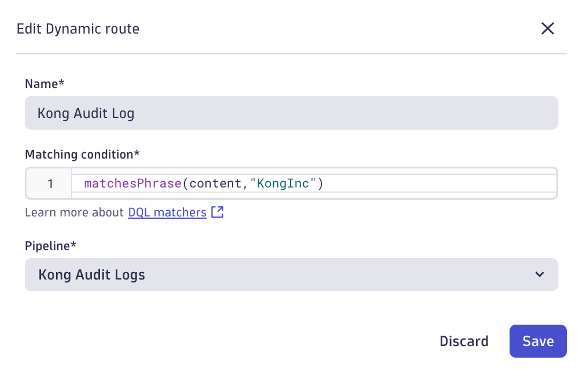

# Kong Konnect Audit Log Extension

A **Dynatrace Extension 2.0** that bundles an OpenPipeline configuration and dashboard for monitoring [Kong Konnect Audit Logs](https://docs.konghq.com/konnect/org-management/audit-logging/)

>

## What It Does

Kong Konnect can stream [Kong Konnect Audit Logs](https://docs.konghq.com/konnect/org-management/audit-logging/) to Dynatrace via webhook (`/api/v2/logs/ingest`). This extension:

1. **OpenPipeline source** — routes incoming logs from the extension source to the dedicated pipeline
2. **OpenPipeline pipeline** — parses Kong's JSON audit log format, extracting fields for authentication, authorization, and access events
3. **Dashboard** — visualizes audit activity: event counts, user activity, security events, and failed operations

## Project Structure

```
extension-kong-auditlog/
├── extension/                          # Extension 2.0 package source
│   ├── extension.yaml                  # Extension manifest
│   ├── documents/
│   │   └── overview.dashboard.json     # Kong Audit Logs dashboard
│   └── openpipeline/
│       ├── logs.pipeline.json          # Log parsing pipeline
│       └── logs.source.json            # Log source routing config
└── README.md
```

## Developer Setup

### Prerequisites

- Dynatrace environment (1.333+)
- [Dynatrace Extensions VS Code plugin](https://marketplace.visualstudio.com/items?itemName=DynatracePlatformExtensions.dynatrace-extensions)
- Kong Konnect configured to push audit logs to your Dynatrace tenant's log ingest endpoint

### 1. Install the Dynatrace Extensions VS Code Plugin

Install the [Dynatrace Extensions](https://docs.dynatrace.com/docs/ingest-from/extensions/develop-your-extensions/addon-for-vscode) plugin from the VS Code marketplace. This plugin handles building, signing, and uploading Extension 2.0 packages.

### 2. Create a Classic API Token

In your Dynatrace tenant, create a classic API token using the **Extension Development** template:

1. Go to **Settings → Access tokens → Generate new token**
2. Select the **Extension Development** token template (this pre-selects all required scopes)
3. Copy the generated token — you will need it in the next step

### 3. Configure the VS Code Plugin

Connect the plugin to your tenant:

1. Open the VS Code Command Palette (`Cmd+Shift+P` / `Ctrl+Shift+P`)
2. Run **Dynatrace Extension: Focus on Environments View**
3. Enter your environment URL, e.g. `https://MY-TENANT.live.dynatrace.com`
4. Enter the classic API token from step 2

### 4. Generate a Signing Certificate

Extension 2.0 packages must be signed before upload. Generate a self-signed certificate:

1. Open the Command Palette
2. Run **Dynatrace Extension: Generate certificate**
3. The plugin creates a key pair and saves it locally

### 5. Note the Certificate Path

You need the path to the generated `ca.pem` file:

1. Open **VS Code Settings**
2. Navigate to **Extensions --> Dynatrace Extensions --> Certificates**
3. In the **Certificates Path** make a note of the directory path

The `ca.pem` file is in that directory.  You need that for the next step.

### 6. Upload the CA Certificate to Dynatrace

Dynatrace must trust your signing certificate to accept the extension:

1. In your Dynatrace tenant, go to **Settings → Credentials vault → Add new credentials**
2. Set **Credentials type** to **Public certificate**
3. Upload the `ca.pem` file from the path found in step 5
4. Check **Extension validation** — this registers the cert for verifying extension signatures
5. Save

Once this is done, extensions signed with your local key will be accepted by your tenant.

## Building and Deploying Using the VS Code Extension

The `.vscode/settings.json` is already configured with the correct schemas. With the Dynatrace Extensions VS Code plugin:

1. Open this workspace in VS Code
2. Run **Dynatrace Extension: Build** command to create a signed ZIP file.  This increase the version number too and put the ZIP file into the `dist` folder.  
3. The **build** command will also prompt for uploading the ZIP.  Alternatively, use Run **Dynatrace Extension: Upload** command to deploy to your tenant

## Verify Install

1. Open OpenPipeline in settings
2. Navigate to `Logs --> Dynamic Routing` 
3. The pipeline should be shown as below



1. Navigate to `Dashboards` 
2. Search for `Kong Audit Log` and it should appear as shown below



## Configuring OpenPipeline

An OpenPipeline Dynamic Route need to be configure.  Dynamic routing is when data is routed based on a matching condition. The matching condition is a DQL query that defines the data set you want to route.  To do this:

1. Open OpenPipeline in settings
2. Navigate to `Logs --> Dynamic Routing` 
3. Choose `Add Dynamic Route`
4. Fill is as shown below and click `Save`.  The Matching condition is `matchesPhrase(content,"KongInc")`



## Kong Konnect Configuration

In Kong Konnect, configure an audit log webhook to POST to:

```
https://<your-tenant>.live.dynatrace.com/api/v2/logs/ingest
```

With headers:
```
Authorization: Api-Token <your-dt-api-token>
Content-Type: application/json
```

The API token needs the **Ingest logs** (`logs.ingest`) scope.

## OpenPipeline Field Mapping

The pipeline maps Kong Konnect's raw JSON fields to the [Dynatrace Audit Log semantic model](https://docs.dynatrace.com/docs/semantic-dictionary/model/log#audit-logs). Fields that have no semantic equivalent are stored as `kong.konnect.*` vendor-namespaced attributes, following the same `vendor.product.attribute` convention used by `aws.s3.*`, `azure.container_app.*`, etc.

### Common Fields (all three event types)

| Konnect JSON Field | DT Semantic Field | Transform |
|---|---|---|
| `principal_name` / `principal_id` | `audit.identity` | `coalesce(principal_name, principal_id)` — uses human-readable name when configured in Konnect, falls back to UUID |
| `event_ts` | `audit.time` | `toTimestamp(event_ts)` — ISO 8601 string → timestamp |
| `src` | `client.ip` | direct |
| `user_agent` | `browser.user_agent` | direct |
| `trace_id` | `trace_id` | direct |
| `trace_id` + `rt` | `log.record.uid` | composed: `concat(trace_id, "_", rt)` — Konnect has no per-event unique ID |
| `rt` | `timestamp` | `rt * 1,000,000` — converts Konnect's Unix milliseconds to DT nanoseconds |
| _(static)_ | `log.source` | `"konnect-audit-webhook"` |
| _(static)_ | `cloud.provider` | `"konghq"` |
| `org_id` | `kong.konnect.org.id` | custom — multi-tenant scope; no DT semantic equivalent |
| `sig` | `kong.konnect.sig` | custom — ED25519 integrity signature |
| `kong_initiated` | `kong.konnect.initiated` | custom — boolean; distinguishes system-initiated from user-initiated actions |

Fields `cef_version`, `event_class_id`, `event_product`, `event_vendor`, `event_version`, `name`, `severity`, and `principal_name` are CEF wire-format artifacts and are dropped on ingest.

---

### Authentication Events

Detected by: `matchesPhrase(content, "\"success\"")`

The authentication type and outcome are carried in the CEF `event_class_id` and `name` JSON fields respectively.

| Konnect JSON Field | DT Semantic Field | Transform |
|---|---|---|
| `event_class_id` | `audit.action` | strip `AUTHENTICATION_TYPE_` prefix → human label: `BASIC`→`"Basic Authentication"`, `SSO`→`"SSO Authentication"`, `PAT`→`"PAT Authentication"` |
| `success` | `audit.result` | `true`→`"Succeeded"`, `false`→`"Failed"` |
| `name` | `audit.status` | strip `AUTHENTICATION_OUTCOME_` prefix → map: `SUCCESS`→`"Succeeded"`, `LOCKED`/`DISABLED`→`"Active"`, others→`"Failed"` |

---

### Authorization Events

Detected by: `matchesPhrase(content, "\"action\"")`

> **Volume filter:** Only `granted=false` (denied) events are forwarded to storage. Events where `granted=true` are dropped in the pipeline — authorization checks fire on every API call, making successful grants extremely high volume with low security signal value.

| Konnect JSON Field | DT Semantic Field | Transform |
|---|---|---|
| `action` | `audit.action` | direct — clean action verbs: `retrieve`, `list`, `edit`, etc. |
| `granted` | `audit.result` | `true`→`"Succeeded"`, `false`→`"Failed"` |
| `granted` | `audit.status` | same transform as `audit.result` |
| `actor_id` | `kong.konnect.actor.id` | custom — delegation or impersonation identity; no DT semantic equivalent |

---

### Access Events

Detected by: `matchesPhrase(content, "\"status\"")`

Access events are HTTP access logs (mutating API operations). The `audit.action` field is composed from the HTTP verb and request path since there is no single action field.

| Konnect JSON Field | DT Semantic Field | Transform |
|---|---|---|
| `act` + `request` | `audit.action` | composed: `concat(act, " ", request)` e.g. `"POST /konnect-api/api/vitals/v1/explore"` |
| `status` | `audit.result` | `2xx`→`"Succeeded"`, all others→`"Failed"` |
| `status` | `result.code` | direct (long) — HTTP status code |

---

### DQL Anchor Queries

```dql
// All Konnect audit events
fetch logs
| filter log.source == "konnect-audit-webhook"
| fields timestamp, konnect_format, audit.identity, audit.action, audit.result, client.ip, result.code
| sort timestamp desc

// Authentication failures by method
fetch logs
| filter log.source == "konnect-audit-webhook" and konnect_format == "authentication" and audit.result == "Failed"
| summarize failures = count(), by: {audit.action, audit.identity, client.ip}
| sort failures desc

// Authorization denials
fetch logs
| filter log.source == "konnect-audit-webhook" and konnect_format == "authorization"
| fields timestamp, audit.identity, audit.action, client.ip

// Access errors (4xx / 5xx)
fetch logs
| filter log.source == "konnect-audit-webhook" and konnect_format == "access" and result.code >= 400
| fields timestamp, audit.identity, audit.action, result.code
| sort timestamp desc
```

## Resources

- [Dynatrace Extensions 2.0 Documentation](https://www.dynatrace.com/support/help/extend-dynatrace/extensions20)
- [OpenPipeline Documentation](https://www.dynatrace.com/support/help/platform/opentelemetry/openpipeline)
- [Kong Konnect Audit Logs](https://docs.konghq.com/konnect/org-management/audit-logging/)
